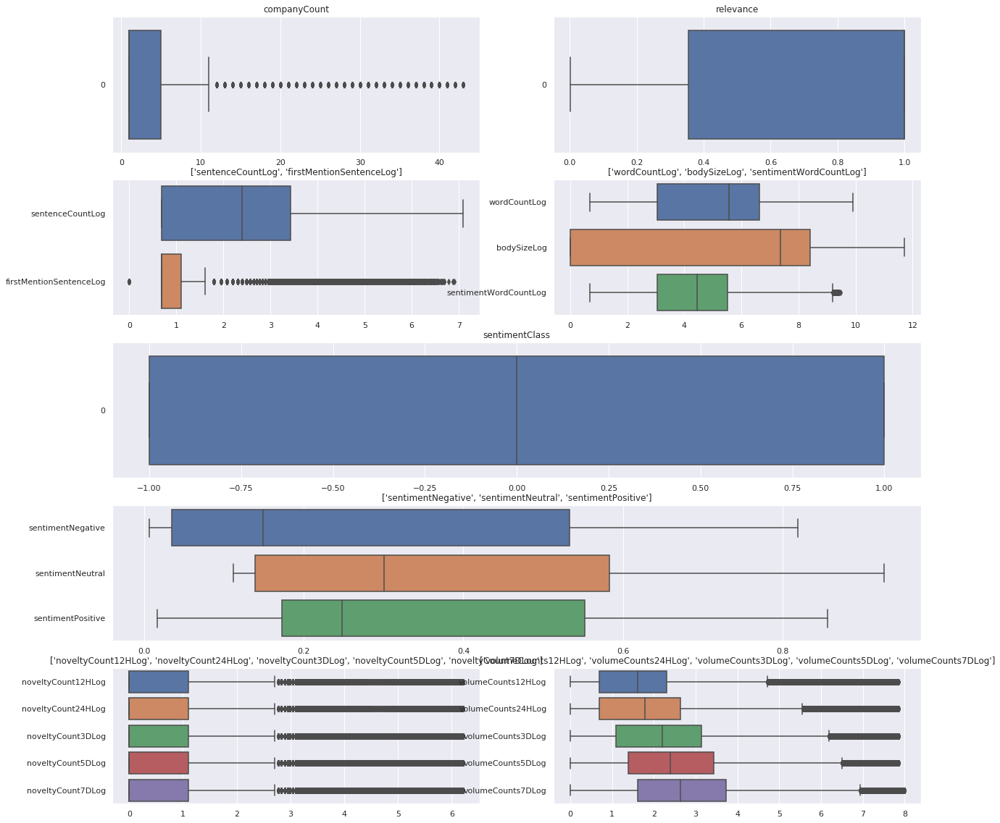
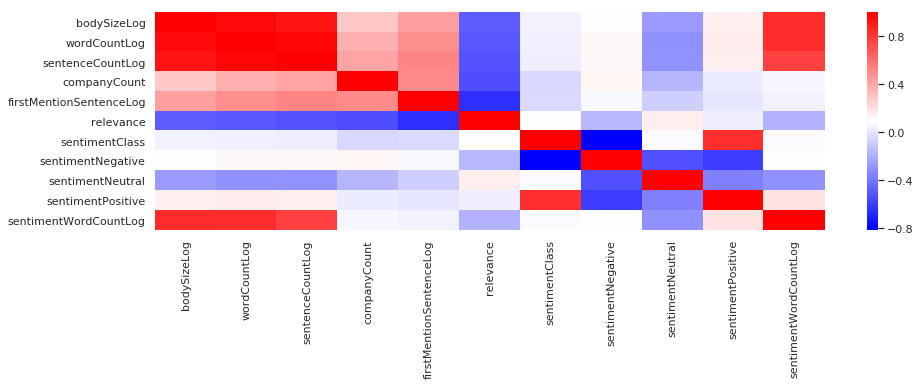
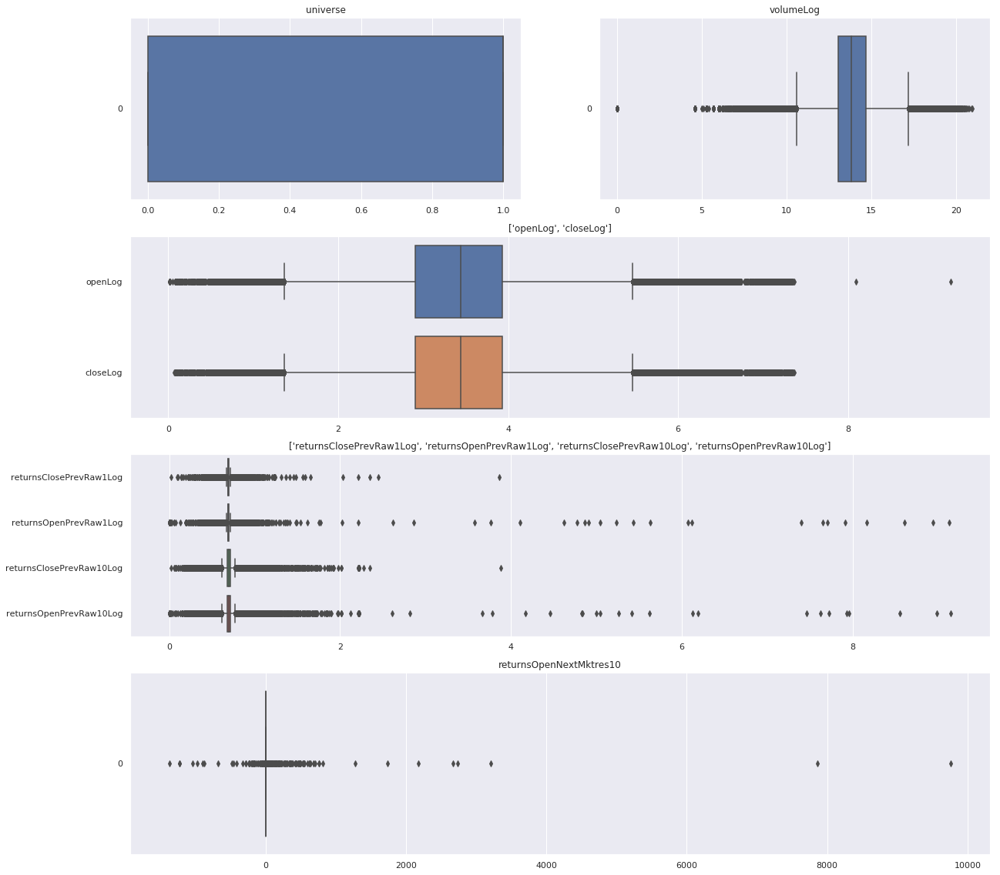
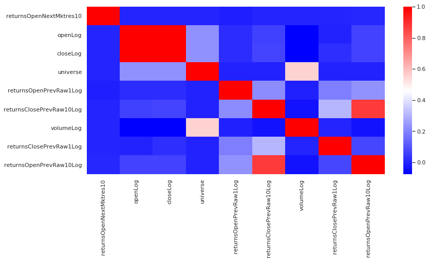

---
# Project Predictive Modeling: MVP
### Predicting future stock price returns. *(a Kaggle competition from sigma2)*

## Introduction

Can we actually predict stock prices with Machine Learning? 

Investors make educated guesses by analyzing data. They'll read the news, study the company history, industry, trends...  There are lots of data points that go into malking a predction. 
The prevailing theory is that stock prices are totally random and unpredicatble. A blind-folded monkey throwing darts at a newspaper's financial pages could select a protfolio that could do just as well as one carefully selected by experts. 

But that raises the question, why do top firms like Morgan Stanley and citigroup hire quantitative analysts to go build predictive models. We have this idea of a trading floor filled with adrenalined-infused men, with loose ties, running around, yelling something into a phone. But these days are more likely to see rows of ML experts quietly sitting in front of computer screens in fact about 70% of all orders on Wall street are now placed by software. 

We are now living in the age of algorithms. 

## Question: 

This kaggle competition aims to predict stock price performance by extracting features from pieces of news. 

## Datasets

This competition is only supported using the Kaggle kernel environment (i.e., we cannot use our PC notebook or other IDE environment). 
Kaggle provides 2 csv files, one with all the necessary market data and the other with the necessary news information.

#### Market

This dataset contains market data from February 2007 to December 2016

- Data Set Characteristics:
    - Number of Instances: 4072956
    - Number of Attributes: 16 types (13 numeric, 2 categorical (or text) and 1 datetime)
    - Missing Attribute Values: few values from features: returnsClosePrevMktres1, returnsOpenPrevMktres1, returnsClosePrevMktres10, returnsOpenPrevMktres10
    - Donor: Market data provided by Intrinio. 

| **Variable** | **Definition** | **Key** |
| ---------| --------- |
| time | the current time | datatime64[ns, UTC]|
| assetCode | Unique id of an asset | object |
| assetName | Name that corresponds to a group of assetCodes | category |
| universe | a boolean indicating whether or not the instrument on that day will be included in scoring | float64 |
| volume| trading volume in shares for the day| float64 |
| close| the close prize for the day | float64 |
| open| the open prize for the day | float64 |
| returnsClosePrevRaw1| Returns calculated close-to-close for raw data | float64 |
| returnsOpenPrevRaw1| Returns calculated open-to-open for raw data | float64 |
| returnsClosePrevMktres1| Returns calculated close-to-close for market-residualized (MKtres) for one day | float64 |
| returnsOpenPrevMktres1| Returns calculated open-to-open for market-residualized (MKtres) for one day | float64 |
| returnsClosePrevRaw10| Returns calculated close-to-close for raw datafor previous 10 days | float64 |
| returnsOpenPrevRaw10| Returns calculated open-to-open for raw datafor previous 10 days | float64 |
| returnsClosePrevMktres10| Returns calculated close-to-close for market-residualized (MKtres) for 10 days | float64 |
| returnsOpenPrevMktres10| Returns calculated open-to-open for market-residualized (MKtres) for previous 10 days | float64 |
| returnsOpenNextMktres10| Returns calculated open-to-open for market-residualized (MKtres) for next 10 days | float64 |

#### News

Contains news data from January 2007 to December 2016

- Data Set Characteristics:
    - Number of Instances: 9328750
    - Number of Attributes: 35 types (15 numeric, 11 categorical and 3 boolean)
    - Missing Attribute Values: Unknown due to memory limit
    - Donor: News data provided by Thomson Reuters. Copyright ©, Thomson Reuters, 2017. All Rights Reserved.

| **Variable** | **Definition** | **Key** |
| ---------  | ---------  |
| time  | UTC timestamp of this news item when it was created  | datatime64[ns, UTC] |
| firstCreated  | UTC timestamp for the first version of the item | datatime64[ns, UTC]|
| sourceId | an Id for each news item| object   |
| headline  | the item's headline | object|
| urgency  | differentiates story types (1: alert, 3: article) | int8 |
| takeSequence  | the take sequence number of the news item, starting at 1. For a given story, alerts and articles have separate sequences. | float64 |
| provider | identifier for the organization which provided the news item (e.g. RTRS for Reuters News, BSW for Business Wire) | category |
| subjects | topic codes and company identifiers that relate to this news item. Topic codes describe the news item's subject matter. These can cover asset classes, geographies, events, industries/sectors, and other types. | category |
| audiences |  identifies which desktop news product(s) the news item belongs to. They are typically tailored to specific audiences. (e.g. "M" for Money International News Service and "FB" for French General News Service) | category |
| bodySize | the size of the current version of the story body in characters | int32 |
| companyCount | the number of companies explicitly listed in the news item in the subjects field | int8 |
| headlineTag | the Thomson Reuters headline tag for the news item | object |
| marketCommentary | boolean indicator that the item is discussing general market conditions, such as "After the Bell" summaries | bool |
| sentenceCount |  the total number of sentences in the news item. Can be used in conjunction with firstMentionSentence to determine the relative position of the first mention in the item. | int16 |
| wordCount | the total number of lexical tokens (words and punctuation) in the news item | int32 |
| assetCodes | list of assets mentioned in the item | category |
| assetName |  name of the asset | category |
| firstMentionSentence | the first sentence, starting with the headline, in which the scored asset is mentioned. 1: headline, 2: first sentence of the story body, 3: second sentence of the body, etc, 0: the asset being scored was not found in the news item's headline or body text. As a result, the entire news item's text (headline + body) will be used to determine the sentiment score.  | int16 |
| relevance | a decimal number indicating the relevance of the news item to the asset. It ranges from 0 to 1. If the asset is mentioned in the headline, the relevance is set to 1. When the item is an alert (urgency == 1), relevance should be gauged by firstMentionSentence instead. | float32 |
| sentimentClass | indicates the predominant sentiment class for this news item with respect to the asset. The indicated class is the one with the highest probability. | int8 |
| sentimentNegative | probability that the sentiment of the news item was negative for the asset | float32 |
| sentimentNeutral | probability that the sentiment of the news item was neutral for the asset | float32 |
| sentimentPositive | probability that the sentiment of the news item was positive for the asset | float32 |
| sentimentWordCount| the number of lexical tokens in the sections of the item text that are deemed relevant to the asset. This can be used in conjunction with wordCount to determine the proportion of the news item discussing the asset. | int32 |
| noveltyCount12H | The 12 hour novelty of the content within a news item on a particular asset. It is calculated by comparing it with the asset-specific text over a cache of previous news items that contain the asset. | int16 |
| noveltyCount24H| same as above, but for 24 hours | int16 |
| noveltyCount3D| same as above, but for 3 day | int16 |
| noveltyCount5D| same as above, but for 5 day | int16 |
| noveltyCount7D| same as above, but for 7 day | int16 |
| volumeCounts12H| the 12 hour volume of news for each asset. A cache of previous news items is maintained and the number of news items that mention the asset within each of five historical periods is calculated. | int16 |
| volumeCounts24H| same as above, but for 24 hours | int16 |
| volumeCounts3D| same as above, but for 3 days | int16 |
| volumeCounts5D| same as above, but for 5 days | int16 |
| volumeCounts7D| same as above, but for 7 days | int16 |

## Algorithm
1. Data Acquisition
2. Preprocessing
    - Prep the news dataframe by expanding the data for every assetCode. 
    - The news info needs to be grouped by the day determined by the market column called *'time'*. 
        - Since merging is based in time: From yesterday at 22h01 til today at 22h
    - Merge news and market dataframes (by assetCode and time): At this point 
3. Training: 
    The training data given is controled by time. 
2. Testing
    - market_obs_df, news_obs_df, predictions_template_df
    - For every assetCode in the predictions_template_df test your model to get the confidence interval. 
    - The validation process involves 628 iterations. For every iteration it is given a market data for a day D and news informations starting at 10:01pm on the previous day til day D at 10pm. 

## Preprocessing
### MARKET
#### Feature Selection

To recall I'm going to model the prediction of the variable for each asset code.  
There are a few assetCodes pertaining to the same asset, because of this reason and the fact there are assets whose name is unknown and yet they have valid unique asset codes, that I will keep the asset codes and get rid of the asset names. 

Some Missing Values and their %: 
    - returnsClosePrevMktres1	0.392344
    - returnsOpenPrevMktres1	0.392540
    - returnsClosePrevMktres10	2.283599
    - returnsOpenPrevMktres10	2.284680
In other words I cannot count with the residualized open-to-open and close-to-close for one day and 10 days. Since they show a high correaltion with their homologue raw features unless they show an improvement to the classifier's performance they will be added as an upgrade. 

As for the news info, there are pieces of news that refer to 1 or more asset codes, therefore Im going to transform the news table so that it will be indexed by a single and unique asset code. This means that the number of rows will increase adding more redundancy to the training dataset. (Can this be avoided?)
Furthermore I'm leaving out of the feature selection: the headline, take sequence, provider, headlinetag and assetName since at first glance they are not fit to relate with the stock change. 

#### Normalization

I will use the log transform to normalize these highly skewed features. Since they can have negative values the process will start with a translation by a constant then the transformation by the log.

#### Vectorization

Since Im using features in both tables it's easier to merge them. It's important to consider that the Market table has the target variable called *returnsOpenNextMktres10* with a domain in the natural numbers. The key in common between the tables is the assetCode. But first a small manip needs to be performed unto the news table since every row can contain 1 or more asset codes. 

#### Feature Engineering

- Time features: 
    - time(datetime64[ns, UTC]) - UTC timestamp showing when the data was available on the feed (second precision)
    - sourceTimestamp(datetime64[ns, UTC]) - UTC timestamp of this news item when it was created
    - firstCreated(datetime64[ns, UTC]) - UTC timestamp for the first version of the item

In other words: *time >= sourceTimestamp >= firstCreated*  
***Are these time features statistically significant to consider each one of them?*** If so they can be feature-engineered by their time-difference from the news piece's origin (firstCreated). 

- t-statistic for the time features
- There are 1631 unique subjects and every asset has in average 20. 
- There are 191 unique audiences and every asset has an average of 5. 

## EDA

#### News

#### Market

## Results Submission

Logit regressors are commonly used to estimate the probability that an instance belongs to a particular class. So the prediction can be made by classifying on whether a stock will rise or sink. 

## Intial research and Results
Build a 10 day window 