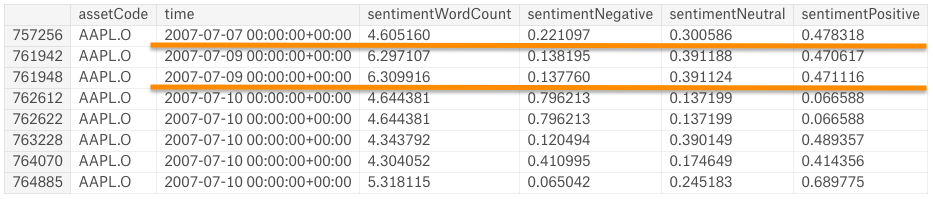

# Project Predictive Modeling: MVP
### Predicting future stock price returns. *(a Kaggle competition from sigma2)*

## Introduction

***Can we actually predict stock prices with Machine Learning?***

In this kaggle competition (*see link at the endof this document*), I must predict a signed confidence value, ŷ ti∈[−1,1] , which is multiplied by the market-adjusted return of a given assetCode over a ten day window. If a stock is expected to have a large positive return *compared to the broad market* over the next ten days, a large, positive confidenceValue (near 1.0) should be assigned. If the stock is expected to have a negative return, a large, negative confidenceValue (near -1.0) must be assigned. If unsure, assign it a value near zero.

## Question: 

This kaggle competition aims to predict stock price performance by extracting features from pieces of news. 

## Datasets

This competition is only supported using the Kaggle kernel environment (i.e., we cannot use our PC notebook or other IDE environment). 
Kaggle provides 2 csv files, one with all the necessary market data and the other with the necessary news information.

#### Market

This dataset contains market data from February 2007 to December 2016

- Data Set Characteristics:
    - Number of Instances: 4072956
    - Number of Attributes: 16 types (13 numeric, 2 categorical (or text) and 1 datetime)
    - Missing Attribute Values: few values from features: returnsClosePrevMktres1, returnsOpenPrevMktres1, returnsClosePrevMktres10, returnsOpenPrevMktres10
    - Donor: Market data provided by Intrinio. 

The **target label** is returnsOpenNextMktres10. In the training set for date t, this is the return from t+1 market open to t+10 market open.

#### News

Contains news articles/alerts data from January 2007 to December 2016

- Data Set Characteristics:
    - Number of Instances: 9328750
    - Number of Attributes: 35 types (15 numeric, 11 categorical and 3 boolean)
    - Missing Attribute Values: Unknown due to memory limit
    - Donor: News data provided by Thomson Reuters. Copyright ©, Thomson Reuters, 2017. All Rights Reserved.

*ML modeling strategy*

I could consider each asset as an ML instance, aggregate each piece of news and roll up the review sentiment into either an average score or a multiclass model.
Or I could treat every market date along with every asset (available for that date) as an ML instance and then assign it some measures of spread such as the mean of the news features' scores.

## EDA

#### Market with normalized variables


In the above collection of boxes is shown than the open values are closely correlated with the closing values. Also the target value (returnsOpenNextMktres10) is not normalized and so it shows how the other variables were before normalization: With several outliers.


In a better view, thanks to the correlogram aside from confirming the open/close relationship it shows how the values in the returns are correct. The returns for day 1 are correlated with those of day 10. 

#### News with normalized variables


In the second row of the above graph, the features representing the size of the news piece have pretty much te same range of normalized values however not the same distribution. In the 4th row a graph of each sentiment's polarity where the neutral's median is highest suggesting higher values in each news piece. Finally in the 5th row the novelty count series have pretty much the same values. As for the volume features they show a correct effect of cumulation over time. 


In the figure above the features of size prove a high correlation which is not a surprise. In the dimensionality reduction module I might consider removing some. The feature *sentimentClass* is positively correlated with the *sentimentPositive* feature and negatively correlated with the *sentimentNegative* feature. 


## Data Acquisition

Kaggle provides the following functions to retrieve the two dataframes:

```python
# First let's import the module and create an environment.
from kaggle.competitions import twosigmanews
# You can only call make_env() once, so don't lose it!
env = twosigmanews.make_env()
(market_train_df, news_train_df) = env.get_training_data()
```

## Preprocessing

### Normalizing taget value

It's important to consider that the Market table has the target variable called *returnsOpenNextMktres10* with a domain in the natural numbers. The action is to clip it to be between 0 and 1. 0 if the return is negative and therefore the stock price did not rise and 1 otherwise.  

### Normalization:

I will use the log transform to normalize these highly skewed features. Since they can have negative values the process will start with a translation by a constant then the transformation by the log.

### Trimming dataset from useless columns

There are a few assetCodes pertaining to the same asset (assetName), because of this reason and the fact there are assets whose name is unknown and yet they have valid unique asset codes, that I will keep the asset codes and get rid of the variable assetNames. 

Some Missing Values and their %: 
    - returnsClosePrevMktres1	0.392344
    - returnsOpenPrevMktres1	0.392540
    - returnsClosePrevMktres10	2.283599
    - returnsOpenPrevMktres10	2.284680
In other words I cannot count with the residualized open-to-open and close-to-close for one day and 10 days since they show a high correaltion with their homologue raw features and unless they show an improvement to the classifier's performance they will be added as an upgrade. 


### Prep the news and market tables to be merged into one. 

Since Im using features in both tables it's easier to merge them. The key in common between the tables is the assetCode and time. But first a small manip needs to be performed unto the news table since every row can contain 1 or more asset codes. 

1. Consolidate times
    - The news info needs to be grouped by the day determined by the market column called *'time'*. 
    - Since merging is based in time: From yesterday at 22h01 til today at 22h
        - i.e: 
            - 2007-01-01 22:00:01+00:00 -> 2007-01-02 
            - 2007-01-01 21:59:59+00:00 -> 2007-01-01
2. Asset Code expansion
    As for the news info, there are pieces of news that refer to 1 or more asset codes, therefore Im going to transform the news table so that it will be indexed by a single and unique asset code. This means that the number of rows will increase adding more redundancy to the training dataset. (Can this be avoided?)
    Furthermore I'm leaving out of the feature selection: the headline, take sequence, provider, headlinetag and assetName since at first glance they are not fit to relate with the stock change. 
    
3. Group the news by their date and median
    The pieces of news for a specific asset code and timeframe (market day) will be consolidated into one row as shown below: 
    
    Notice that the feature values have not taken into consideration but rather their metrics of spread. In this case they are going to be median, std, min and max.
    Then the news table is merged with the market one by time and assetcode respectively as shown below
    
4. Merge the market data with their respective news info by their date and asset code. 


## Intial research and Results

A good place to start is with a Stochastic Gradient Descent (SGD) classifier, using Scikit-Learn’s SGDClassifier class which uses a linear classifier such as SVM or logistic regression with SGD training. 

``` python
from sklearn.linear_model import SGDClassifier
```

Based on the confusion matrix, the classifier correctly predicted 2609 instances with negative stock returns, and missed 6200. Correctly predicted 6821 instances going upwards but missed 2645. 


In this project the aim is to have similar values in precision and recall. Increasing recall will make this model to make sure it doesnt miss any stock in the rise, but some of its predictions will be incorrect. The threshold is therefore correctly placed at 0 maximizing the f1 score. 

The precision/recall curve doesnt have a conventional shape. It shows that the precision will always be between 0.4 and 0.6 no matter the recall. 

The ROC curve shows the nature of this SDG classifier: just a purely random classifier. 

These are the results of the evaluation metrics: 

- Accuracy: 0.51
- Precision: 0.52
- Recall: 0.72
- F1Score: 0.61
- AUC: 0.499

## Future improvements

1. Use from sklearn.preprocessing the LabelEncodes as it transforms categorical vars (asset codes) into numerical. 
2. The AUC score can be improved by getting the scores of the predictions in probabilities rather than just boolean values. In the same path logit regressors are commonly used to estimate the probability that an instance belongs to a particular class. So the prediction can be made by classifying on whether a stock will rise or sink. 
3. And most important of all, predicting something as random as the stock returns is not an easy task. There is much work to do to raise the evaluation metrics. Trying other models, refining feature engineering and implementing other strategies such as building ensembles, etc..

## Limitations

- Since this is a Kernels-only, time-based competition, I'm bound to use the kaggle kernel which is not very practical nor fast. I'm bound to make sure every test I make on their kernel is correctly designed (so there is no time wasting with simple errors). This is designed to simulate the volume, timeline, and the computational burden that real future data will introduce.
- The assetCode is not guaranteed to be unique over time. Here I specifically chose AAPL.O because we all know Apple hasn't changed it's ticker symbol. But that's not guaranteed so you have to be very careful. 

### Links and other resources

- Kaggle competition: 

    https://www.kaggle.com/leegare/two-sigma-news-official-getting-started-kernel