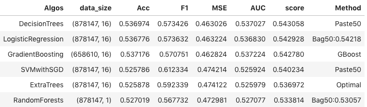

# Project Predictive Modeling: MVP
### Predicting future stock price returns. *(a Kaggle competition from sigma2)*

## Introduction

***Can we actually predict stock prices with Machine Learning?***

In this kaggle competition (*see link at the endof this document*), I must predict a signed confidence value, ŷ ti∈[−1,1] , which is multiplied by the market-adjusted return of a given assetCode over a ten day window. If a stock is expected to have a large positive return *compared to the broad market* over the next ten days, a large, positive confidenceValue (near 1.0) should be assigned. If the stock is expected to have a negative return, a large, negative confidenceValue (near -1.0) must be assigned. If unsure, assign it a value near zero.

## Question: 

This kaggle competition aims to predict stock price performance by extracting features from pieces of news. 

## Datasets

This competition is only supported using the Kaggle kernel environment (i.e., we cannot use our PC notebook or other IDE environment). 
Kaggle provides 2 csv files, one with all the necessary market data and the other with the necessary news information.

#### Market

This dataset contains market data from February 2007 to December 2016

- Data Set Characteristics:
    - Number of Instances: 4072956
    - Number of Attributes: 16 types (13 numeric, 2 categorical (or text) and 1 datetime)
    - Missing Attribute Values: few values from features: returnsClosePrevMktres1, returnsOpenPrevMktres1, returnsClosePrevMktres10, returnsOpenPrevMktres10
    - Donor: Market data provided by Intrinio. 

The **target label** is returnsOpenNextMktres10. In the training set for date t, this is the return from t+1 market open to t+10 market open.

#### News

Contains news articles/alerts data from January 2007 to December 2016

- Data Set Characteristics:
    - Number of Instances: 9328750
    - Number of Attributes: 35 types (15 numeric, 11 categorical and 3 boolean)
    - Missing Attribute Values: Unknown due to memory limit
    - Donor: News data provided by Thomson Reuters. Copyright ©, Thomson Reuters, 2017. All Rights Reserved.

*ML modeling strategy*

I could consider each asset as an ML instance, aggregate each piece of news and roll up the review sentiment into either an average score or a multiclass model.
Or I could treat every market date along with every asset (available for that date) as an ML instance and then assign it some measures of spread such as the mean of the news features' scores.

## EDA

#### Market with normalized variables


In the above collection of boxes is shown than the open values are closely correlated with the closing values. Also the target value (returnsOpenNextMktres10) is not normalized and so it shows how the other variables were before normalization: With several outliers.


In a better view, thanks to the correlogram aside from confirming the open/close relationship it shows how the values in the returns are correct. The returns for day 1 are correlated with those of day 10. 

#### News with normalized variables


In the second row of the above graph, the features representing the size of the news piece have pretty much te same range of normalized values however not the same distribution. In the 4th row a graph of each sentiment's polarity where the neutral's median is highest suggesting higher values in each news piece. Finally in the 5th row the novelty count series have pretty much the same values. As for the volume features they show a correct effect of cumulation over time. 


In the figure above the features of size prove a high correlation which is not a surprise. In the dimensionality reduction module I might consider removing some. The feature *sentimentClass* is positively correlated with the *sentimentPositive* feature and negatively correlated with the *sentimentNegative* feature. 

## Data Acquisition

Kaggle provides the following functions to retrieve the two dataframes:

```python
# First let's import the module and create an environment.
from kaggle.competitions import twosigmanews
# You can only call make_env() once, so don't lose it!
env = twosigmanews.make_env()
(market_train_df, news_train_df) = env.get_training_data()
```

## Preprocessing
#### 1. Memory Management

Since memory management is really important in this competition (as their internal kernel doesn't support operations between features or dimensionality reduction algorithms like lle or t-sne), here are a few tricks I am using (with python):

- Performing pandas operations inplace as much as possible
- Deleting unused frames, series and arrays
- *Using manual garbage collection (gc.collect) after deleting objects*
- Set universe column to int8 type
- Set all float columns from float64 to float32 (maybe float16?)

Additionally a memory saving function credit to https://www.kaggle.com/gemartin/load-data-reduce-memory-usage

#### 2. Normalizing taget value

The Market table has the target variable called *returnsOpenNextMktres10* with a domain in the natural numbers. The action is to clip it to be between 0 and 1. The target variable will have a value of 0 if the return is negative and therefore the stock price went down otherwise it will have a value of 1. The objective of this project is to submit the probability that the stock will rise or go down. 

#### 3. Trimming dataset from useless columns

There are a few assetCodes pertaining to the same asset (assetName), because of this reason and the fact there are assets whose name is unknown and yet they have valid unique asset codes, that I will keep the asset codes and get rid of the variable assetNames. 

Furthermore some other columns will be removed as I later found out (in the feature selection) part that they dont have any prediction power. 

#### 4. Feature Engineering

From the remaining columns I could extract more information thanks to the fact that there were more news records within a business day, so I chose the median and standard deviation for some features and the sum of those features that were correlated like the noveltyCount (12H, 24H, ...) to finally calculate their median and std. 

#### 5. Merging the news with the market data. 

Since Im using features in both tables it's easier to merge them. The key in common between the tables is the assetCode and time. But first a small manipulation needs to be performed unto the news table since every row can contain 1 or more asset codes. 

1. Consolidate dates
2. Asset Code expansion
3. Group the news by their date and median

## Dimensionality Reduction

The kaggle kernel doesn't have much capacity to perform complex functions like PCA Kernel, GridSearch and ensemble modeling so my first approach is to reduce the number of features. Nonetheless the kernel dies when the whole dataset is preprocessing, so I divided the dataset in 3 partitions, each pertaining to 3 years of data and proceeded to optimize the current feature set. 

#### 1. Feature (Importance) Selection

A score will be assigned to each feature reflecting an increase (or decrease) in the classifier's performance metrics. These metrics are: Accuracy, Area under the Curve (AUC), F1 score (which takes in consideration the Precision and Recall) and Mean Squared Error (MSE). 

If the score is greater than zero, the feature increases the classifier's prediction power. 
For every classifier the scores will be calculated and only those scores above 0 will be kept. 

Then to select the K best features a one score to qualify them all is defined as below: 

> Score = $^1/_2[(1-MSE)+^1/_3\sum_{i=1}^{3} p\_score_i]$ and $p\_score ∈ [Acc, AUC, F1]$

For each classifier the features whose score was positive, qualified to be in a feature set that later got tested with every classifier. 

The linear SVM with gradient descent (**SGD**) showed results above the dummy classifier's along with the **Logistic Regressor** and the **Decision Trees** who also happen to have the same feature set.

Overall analyzing the elected feature sets, all of the features in the dataset happened to be included, so the best feature would be that one that is in most feature sets and with a high importance. Below is a (unscaled) scatter plot of the presence of the features in the determined classifiers' feature sets (x) vs its predictive power (the lower the value the more predictive). 


A simple KNN will order the feaures in terms of their performance and presence in the sets.

This feature set has 62% of variables relative to the news which get's in axis with the project's goal in using the news as primary source of predictors. The figure below shows the distributions per class of four of the best features.


The separability power of these features, as you can see, is not evident. However they make the classifier achieve the highest scores. This drastically reduces the dataset from 49 to 16 columns and the preprocessing script, which couldn't complete (as the kernel kept dying), now finishes within the 16 minute mark for the whole dataset. 

#### 2. PCA & LDA

The top 16 features proved to be the most useful in presenting the best results from the whole feature set. Furthermore I performed PCA to see if there could be a better score. In parallel I also performed LDA on the optimal feature set and the analysis showed that Decision Trees and SGD performed best with LDA and the Logistic regression classifier got the highest score with data that had already gone through PCA with 8 components. So for the baseline mode these are the elected classifiers.

## Model Selection

#### 1. Hyper-parameter tuning

Once again the SGD and Decision trees classifiers performed better with the 16 features previously established (the logistic regressor kept its place with the dataset transformed by PCA-8).

I also tested the random forests and extra trees classifier but turned out to be outperformed by our trio of classifiers. However there might be a way that I can combine these models to get better results through the **voting ensemble method**

#### 2. Ensemble Training and Boosting

After optimizing the set of 5 with bagging, pasting and boosting the best scores were obtained by the SGD and the Decision Trees classifier, the voting using these two classifiers outweighed their own individual performance: 



## Future improvements

1. Use from sklearn.preprocessing the LabelEncodes as it transforms categorical vars (asset codes) into numerical. 
2. The AUC score can be improved by getting the scores of the predictions in probabilities rather than just boolean values. In the same path logit regressors are commonly used to estimate the probability that an instance belongs to a particular class. So the prediction can be made by classifying on whether a stock will rise or sink. 
3. And most important of all, predicting something as random as the stock returns is not an easy task. There is much work to do to raise the evaluation metrics. Trying other models, refining feature engineering and implementing other strategies such as building ensembles, etc..

## Limitations

- Since this is a Kernels-only, time-based competition, I'm bound to use the kaggle kernel which is not very practical nor fast. I'm bound to make sure every test I make on their kernel is correctly designed (so there is no time wasting with simple errors). This is designed to simulate the volume, timeline, and the computational burden that real future data will introduce.
- The assetCode is not guaranteed to be unique over time. Here I specifically chose AAPL.O because we all know Apple hasn't changed it's ticker symbol. But that's not guaranteed so you have to be very careful. 

### Links and other resources

- Kaggle competition: 

    https://www.kaggle.com/leegare/two-sigma-news-official-getting-started-kernel